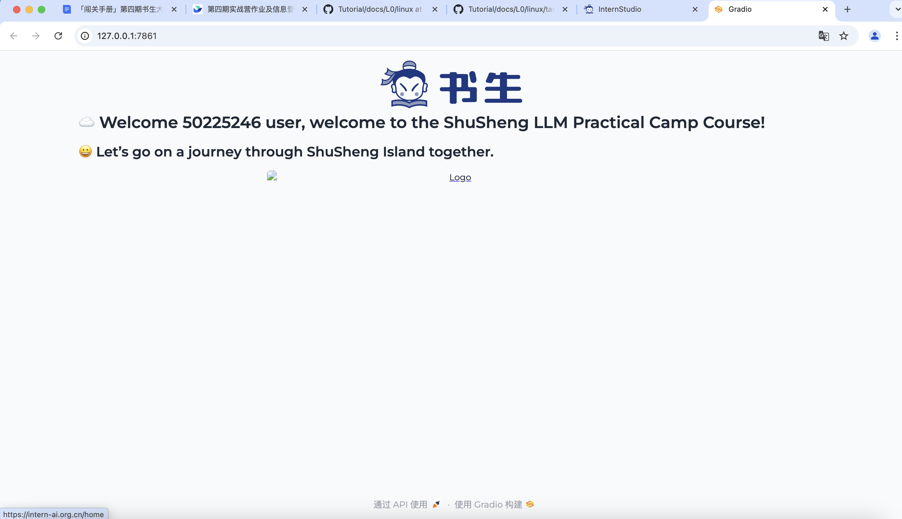

### 完成SSH连接与端口映射并运行hello_world.py
###### ssh链接
ssh -p _ _ -o StrictHostKeyChecking=no -o UserKnownHostsFile=/dev/null

###### 端口转发
vscode 自带端口转发不需要额外设置

###### 运行hello_world.py
python hello_world.py
查看vscode端口窗口，打开127.0.0.1:[窗口号]
