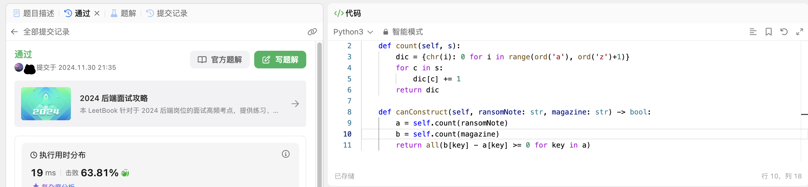
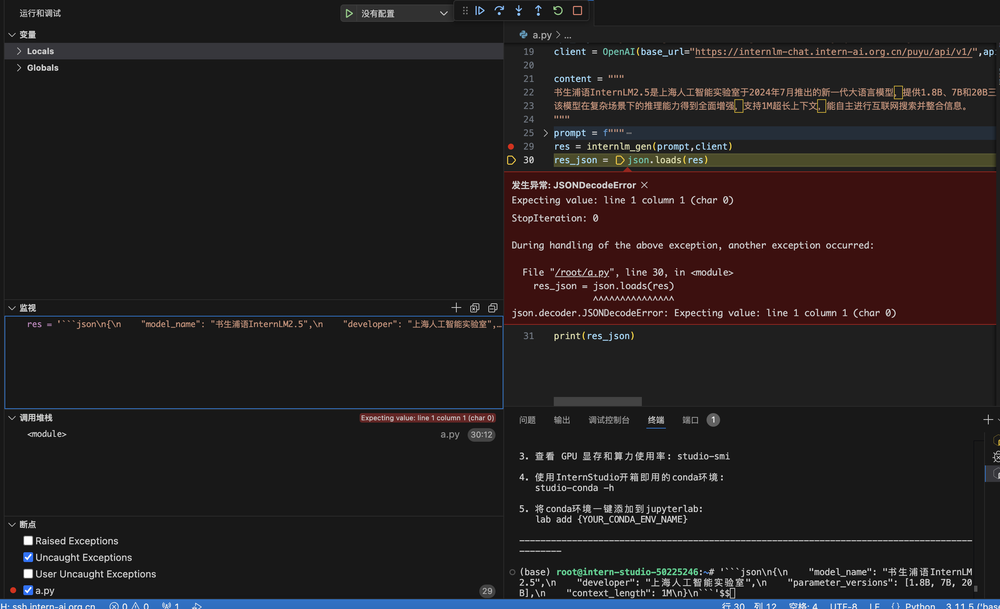

### 完成Leetcode 383, 笔记中提交代码与leetcode提交通过截图

### 书生浦语API实现将非结构化文本转化成结构化json的例子，调bug
1. 登陆https://internlm-chat.intern-ai.org.cn/获取API-key
2. API-key替换demo中的api-key
3. 运行demo发现报错，json.decoder.JSONDecodeError: Expecting value: line 1 column 1 (char 0)，确定问题是返回的结果不符合json格式
4. 使用vscode python debugger在res = internlm_gen(prompt,client)打断点调试
